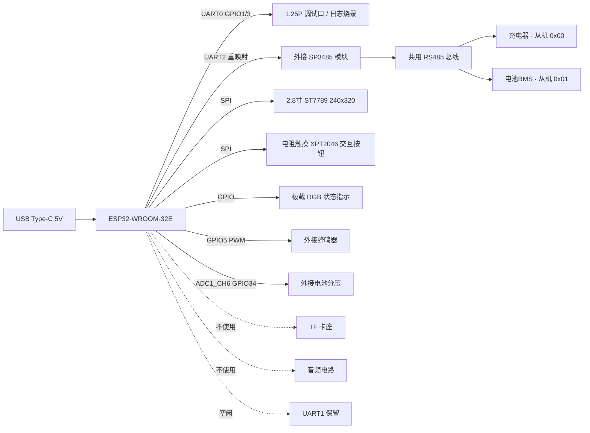

# ESP32-2432S0248R 显示板充电器主控硬件实现方案

> 硬件基线：[ESP32-2432S0248R-PLUS 2.8 寸彩色触摸屏开发板](https://www.zlxchina.xyz/)（本仓库 `esp32显示板/` 目录，含产品手册、Arduino 示例）。配合《协议.md》《实现文档.md》使用，给出基于该开发板的外设映射、外接电路、软件架构与移植要点。
>
> **本方案拓扑**：显示板作为 **RS485 主机**，通过 **1 路 RS485 总线** 同时挂载 **充电器（从机 0x00）** 与 **电池 BMS（从机 0x01）**，按《实现文档.md》与《协议/铁塔BMS协议V3.0.md》完成电池信息读取、充电参数申请与启动充电。

---

## 1. 开发板能力梳理

| 项 | 说明 |
|----|------|
| 主控模组 | **ESP32-WROOM-32E**（双核 Xtensa LX6 @ 240 MHz，520 KB SRAM，4 MB Flash，板载 PCB 天线） |
| 无线 | Wi-Fi 802.11 b/g/n + BT 4.2 BR/EDR + BLE |
| 显示 | **2.8 寸 TFT-LCD 240×320**，ST7789，SPI（BGR 色序初始化） |
| 触摸 | **电阻触摸屏，XPT2046**，SPI（旋转后需重新校准） |
| 板载外设 | TF 卡座、RGB 三色灯、音频接口、扩展 SPI 口、3.3V 电池接口、1.25P UART 口 |
| 供电 | USB Type-C 5V；逻辑电平 3.3V |
| 调试 | 1.25P UART 口（UART0）；部分批次 USB 内置 CH340 可直接串口 |
| 尺寸 | 86mm × 50mm |

> 板上**未集成 RS485 收发器**，需外接 **1 路** SP3485/MAX3485 模块；充电器与电池 BMS **共用此 1 路 485 总线**（主从多挂），另一路串口（UART1）空闲保留。

### 与 ESP32-PicoD4 方案的差异（本方案核心变化）

- 显示从 128×64 OLED 升级为 **2.8 寸 240×320 彩色触摸屏**，UI 更丰富、可触摸交互；
- 板上**无独立用户 LED/KEY**：状态指示改用 **RGB 灯**，启停操作改用**屏幕触摸按钮**；
- **仅需 1 路 RS485**：本板作为主机，充电器（0x00）与电池 BMS（0x01）**同挂一路总线**，以 Modbus 从机地址区分，不再区分充电器/电源双总线；
- UART0 默认被 1.25P 调试口占用，UART2 默认引脚（GPIO16/17）被 RGB 灯占用，RS485 须经 **GPIO 矩阵重映射**到空闲引脚；
- 电池接入判定以协议寄存器电压为主、ADC 辅助，取消外接光耦。

---

## 2. 系统框图



---

## 3. 引脚映射（基于 ESP32-2432S0248R）

> ESP32-WROOM-32E 共 3 个 UART：UART0 留给 1.25P 调试口；UART2 默认引脚（GPIO16/17）被 RGB 灯占用，须通过 GPIO 矩阵重映射到**本项目不使用的板载外设引脚**（音频、扩展 SPI、TF 卡）。UART1 空闲保留。

### 3.1 本项目占用的 GPIO

| 功能 | ESP32 GPIO | 板载丝印 | 占用来源 | 备注 |
|------|-----------|---------|---------|------|
| RS485 总线 TX（充电器+BMS） | **GPIO27** | SPI_CS（扩展口） | 扩展口不用 | 接 SP3485 的 DI |
| RS485 总线 RX（充电器+BMS） | **GPIO26** | AUDIO_IN | 音频不用 | 接 SP3485 的 RO |
| RS485 总线 DIR | **GPIO4** | AUDIO_EN | 音频不用 | 半双工自动控制 DE/RE |
| 蜂鸣器 PWM | **GPIO5** | SD_CS | TF 卡不用 | LEDC，故障提示音 |
| 电池分压 ADC | **GPIO34** | BAT_ADC | 输入专用脚 | ADC1_CH6，3.3V 电池口不接 |
| 电池接入光耦（可选） | **GPIO18** | SD_SCK | TF 卡不用 | 输入上拉，物理接入检测 |

### 3.2 板载外设固定占用（复用）

| 功能 | 引脚 | 备注 |
|------|------|------|
| LCD ST7789 | SCK=14, MOSI=13, MISO=12, DC=2, CS=15, BL=21 | SPI；RST 接 EN，不占 GPIO |
| 触摸 XPT2046 | CLK=25, MOSI=32, MISO=39, CS=33, IRQ=36 | 独立 SPI |
| RGB 三色灯 | **低电平点亮**；批次不同映射有差异（手册 R=17/G=22/B=16，V3.0 示例 R=22/G=16/B=17） | 状态指示 |
| UART0 调试 | TX=1 / RX=3 | 1.25P UART 口 |

### 3.3 空闲 / 保留引脚

| GPIO | 来源 | 用途建议 |
|------|------|---------|
| GPIO19 | SD_MISO | 备用（如需第二路 RS485 / 扩展按键）|
| GPIO23 | SD_MOSI | 备用 |

> **注意**：
> 1. GPIO34/36/39 为**输入专用脚**，不可作为普通输出使用；
> 2. RGB 引脚映射随批次有差异，且**低电平点亮**，上板前以实际板子示例（`esp32显示板/Arduino/demos/06_RGB_LED_V3.0`）为准；
> 3. GPIO26/4（音频）、GPIO18/5（TF 卡）、GPIO27（扩展 SPI）物理上仍焊在板上，仅做复用，**固件不得初始化/访问对应外设**；
> 4. 若需保留 TF 卡或音频，可改用空闲引脚 GPIO19/23 承载 RS485。

---

## 4. 外接单路 RS485 子板电路

### 4.1 子板 —— 共用总线（UART2，充电器 + 电池 BMS）

```
                +3.3V
                  │
         ┌────────┴────────┐
   GPIO27├──DI       VCC───┤
   GPIO4 ├──DE/RE          │
   GPIO26├──RO       GND───┤
         │   SP3485        │
         └──A────────B─────┘
            │        │
            ├─120Ω─┤        终端电阻
            ├─680Ω→3V3      偏置上拉
            └─680Ω→GND      偏置下拉
                  │
            TVS SM712 防浪涌
                  │
            ┌─────┴──────┐
        充电器RS485   电池BMS RS485
         (从机 0x00)   (从机 0x01)
```

- 模块推荐：基于 **SP3485EEN / MAX3485** 的 3.3V 半双工收发模块
- DE 与 RE 短接，由 GPIO4 统一控制，发送时拉高
- A/B 串 10Ω 限流后再到 TVS
- **总线拓扑**：充电器与电池 BMS 均并接到同一对 A/B 线上（菊花链/星型接法均可，主干用屏蔽双绞线），主机通过 Modbus 从机地址区分两个设备
- 终端电阻 120Ω **仅在总线物理两端各接 1 个**，偏置电阻在主机侧即可
- 与下游设备之间使用屏蔽双绞线，屏蔽层单端接主控 GND
- 若充电器协议为 RS232/TTL，可将子板替换为 MAX3232 / 直连即可，软件层无需改动

---

## 5. 电池接入与电压检测

### 5.1 主路径
以《实现文档.md》**协议读寄存器返回的电压值**为电池电压主依据（精度由充电器保证）。电池接入/拔出直接按寄存器电压阈值判定（电压 ≥ 10.0V 视为接入），状态机遵循《实现文档.md §8》`ST_IDLE → ST_DETECTED`。

### 5.2 辅助路径（开发板侧）
- 电池+ → 100kΩ → GPIO34（BAT_ADC），GPIO34 再通过 10kΩ 下拉到 GND
  - 分压比 1:11；电池 84V 时 ADC 输入 ≈ 0.7V，需根据电池上限改用 470kΩ/10kΩ（≈1:48）
  - 板上 BAT_ADC 焊有 3.3V 电池接口相关电路，**不接 3.3V 电池**，必要时断开该接口分压
- 软件以 ADC 电压阈值与寄存器电压做**交叉校验**，避免单路噪声误判
- **可选**：外接光耦 PC817（GPIO18 上拉，接入=0 / 拔出=1）作物理接入检测，边沿触发状态机

---

## 6. 软件架构（Arduino + TFT_eSPI / LVGL）

> 沿用本仓库 `charge/arduino/charger_dual_rs485` 的 Arduino 实现骨架，仅替换：
> 1. 串口引脚（UART2 重映射，单路）；
> 2. 轮询逻辑改为**单总线多从机**（充电器 0x00 + BMS 0x01）；
> 3. OLED UI → 2.8 寸 TFT 触摸 UI；
> 4. 用户 LED/KEY → RGB 灯 / 触摸按钮。

### 6.1 模块划分（Arduino loop 非阻塞调度）

| 模块 | 周期 | 职责 |
|------|------|------|
| `task_modbus` | 1000 ms | Serial2 顺序轮询充电器（0x00）与电池 BMS（0x01），心跳 + 读寄存器 |
| `task_fsm` | 200 ms | 推进状态机，按 BMS 充电申请/电池等级下发 `set_vi` / 开机 / 关机 |
| `task_ui` | 50 ms | TFT 刷新电压/电流/状态/进度 |
| `task_io` | 20 ms | 触摸扫描、RGB/蜂鸣器、ADC 消抖 |

### 6.2 RS485 驱动（Serial2 重映射）

```cpp
/* —— 充电器 Serial2 —— */
#define CHG_UART_TXD   27
#define CHG_UART_RXD   26
#define CHG_UART_DE    4

void rs485_init(void)
{
    Serial2.begin(9600, SERIAL_8N1, CHG_UART_RXD, CHG_UART_TXD);  // rx, tx 重映射
    pinMode(CHG_UART_DE, OUTPUT); digitalWrite(CHG_UART_DE, LOW);  // 默认接收态
}
```

> - 复用 `rs485.cpp` 的**软件 DE 控制**：发送前 DE=HIGH → write → flush → DE=LOW，接收按 8ms 帧尾判定；
> - **Serial2 默认引脚（GPIO16/17）被 RGB 灯占用**，必须用 `HardwareSerial::begin(baud, config, rxPin, txPin)` 重映射；
> - 协议层 `read_regs() / cmd_set_vi() / cmd_power_xx()`（《实现文档.md §9》函数）绑定 Serial2，并增加**从机地址参数**（充电器传 0x00、BMS 传 0x01）即可，协议代码无需改动。

### 6.3 单总线多从机轮询策略

同一路 Serial2/RS485 上挂两个从机，主机按地址**顺序轮询**，帧间留 ≥10ms 静默间隔避免总线冲突：

| 从机 | 地址 | 帧模板（TX） | 用途 |
|------|------|-------------|------|
| 充电器 | 0x00 | `00 03 00 01 00 03 54 08` | 读电压/电流/状态（《实现文档.md §4》）|
| 充电器 | 0x00 | `00 0F 00 01 00 02 04 VH VL IH IL CRCCRC` | 设置电压电流 |
| 充电器 | 0x00 | `00 06 00 00 00 FF C8 5B` | 通道1 开机 / 关机 |
| 电池 BMS | 0x01 | `01 03 00 00 00 1E C5 C2` | 读模拟量 0~29（总电压/SOC/电芯电压/温度）|
| 电池 BMS | 0x01 | `01 03 00 29 00 02` | 读充电申请 41~46（常规/快充）|
| 电池 BMS | 0x01 | `01 03 03 E8 00 0C C5 BF` | 读设备 ID（只读，初检）|
| 电池 BMS | 0x01 | `01 01 00 00 00 34 3D DD` | 读开关量（保护状态）|

> **BMS 读取规则**（《协议/铁塔BMS协议V3.0.md》约束）：
> 1. 只使用功能码 **01（开关量）/ 03（寄存器）**，从机地址固定 **0x01**，应答间隔 2~100ms；
> 2. 固定查询顺序：**①设备 ID → ②模拟量 → ③开关量**；
> 3. **充电申请 41~46 分两条指令读**（41~43 常规、44~46 快充），**禁止连续读 41~46、禁止与模拟量合并读取**；
> 4. 充电标志位 `0x0055`=允许充电（按 41/42 请求的电压电流输出）、`0x00AA`=禁止充电（充电器关机）；其他值或旧版电池（无申请字节）由主机按《实现文档.md §4.3》电池等级自主控制。

### 6.4 TFT UI（ST7789 240×320 + 触摸）

- 库：`TFT_eSPI`（初始化按《esp32显示板》产品手册，ST7789 + BGR 色序）+ `XPT2046_Touchscreen`
- 界面布局（240×320，横向）：
  - 顶部状态栏：电压、电流、充电状态
  - 中部进度条：SOC / 充电进度
  - 底部按钮区：`启动` / `停止`（触摸），替代原物理 KEY
  - 故障弹窗：红色大字号告警 + 蜂鸣器
- 可选 LVGL（示例见 `esp32显示板/Arduino/demos/31_LVGL_Demos`）；小项目用 TFT_eSPI 直绘更省资源
- 触摸校准：旋转或坐标方向变化后需重新校准，校准参数存 NVS

### 6.5 状态机与协议
直接复用《实现文档.md §8》`ChargeState` 枚举与 `tick_1s()`，底层 `uart_send/recv` 换成 Arduino 的 `Serial2` 读写、按从机地址分别打包即可；`ST_DETECTED` 阶段电池信息以 BMS 模拟量（总电压/SOC）为主，充电目标电压电流优先取 BMS 充电申请值。

---

## 7. 与开发板原生外设的取舍

| 板载外设 | 是否使用 | 处理方式 |
|----------|----------|----------|
| 2.8 寸 TFT | **使用** | 主显示，ST7789 + BGR |
| 电阻触摸 | **使用** | 启停按钮、人机交互 |
| RGB 三色灯 | **使用** | 慢闪=空闲、快闪=充电中、常亮=充满、红色急闪=故障（低电平点亮）|
| 1.25P UART | 使用 | UART0 仅用于日志、烧录、开发调试 |
| TF 卡座 | 不使用 | 对应 GPIO18/19/23/5 释放给总线/光耦/蜂鸣器 |
| 音频电路 | 不使用 | 对应 GPIO26/4 释放给共用 RS485 总线 |
| 扩展 SPI | 不使用 | GPIO27 释放给共用 RS485 总线 TX |
| 3.3V 电池接口 | 不使用 | BAT_ADC（GPIO34）复用为电池电压采样 |

---

## 8. 移植与编译要点

1. **环境**：Arduino IDE / arduino-cli，开发板包选 **ESP32 Arduino**，目标板选 **ESP32 Dev Module**（4 MB Flash、DIO），详见 `charge/arduino/编译指南.md`
2. **依赖库**：`TFT_eSPI`、`XPT2046_Touchscreen`（可选 `lvgl`）；TFT_eSPI 的 `User_Setup.h` 按第 3 节引脚配置
3. **boot 行为**：充电器上电默认关机（关机态），`ST_IDLE` 读到的电压即电池端电压，可直接用于电池识别（《实现文档.md §10》）
4. **心跳硬约束**：即使处于 `ST_IDLE` 也每秒发一次 `0x03` 读命令，否则充电器 60s 自动关机
5. **TF/音频禁用**：不要初始化 SD 卡与音频，避免与复用引脚冲突
6. **烧录**：1.25P UART 口接 USB-TTL（TX/RX 交叉、GND 共地），板子按住 BOOT 上电进入下载模式；若批次带 CH340 可直接 USB 烧录
7. **触摸校准**：首次上电进入校准界面，参数存 NVS

---

## 9. BOM 增量物料（除开发板外）

| 类别 | 型号 | 数量 | 备注 |
|------|------|------|------|
| RS485 模块 | SP3485/MAX3485 模块 | **1** | 3.3V 兼容、半双工（充电器 + BMS 共用一路）|
| 终端电阻 | 120Ω 1% | **2** | 总线两端 |
| 偏置电阻 | 680Ω 1% | **2** | 上下拉 |
| TVS | SM712 | **1** | A/B 防浪涌 |
| 电阻分压 | 470kΩ + 10kΩ 1% | 各 1 | ADC 采样 |
| 光耦 | PC817（可选） | 0~1 | 物理电池接入检测（GPIO18）|
| 蜂鸣器 | 3.3V/5V 有源 | 1 | GPIO5 驱动，故障提示 |
| 接线端子 | KF128-2P | 若干 | 电池、RS485 接口 |
| USB-TTL 线 | 1.25P 转杜邦 | 1 | 随板附赠 1.25 转 4P 杜邦线即可 |

> 相比 PicoD4 方案：仅 **1 路 RS485** 承载充电器 + 电池 BMS 两从机（收发器减半）；显示、交互、状态指示均由开发板自带完成。

---

## 10. 验证清单

- [ ] TFT 上电显示开机界面（型号 + 固件版本），触摸校准可用
- [ ] 充电器单帧 `00 03 00 01 00 03 54 08`（0x00）在 Serial2 收发正常，CRC 校验通过
- [ ] 电池 BMS 单帧 `01 03 00 00 00 1E C5 C2`（0x01）在 Serial2 收发正常，总电压/SOC/电芯电压解析正确
- [ ] BMS 充电申请 41~46 分两条指令读取，`0x0055` 允许 / `0x00AA` 禁止响应正确
- [ ] 单路总线顺序轮询两个从机，1 s 周期连续 24 h，无丢帧、无总线冲突
- [ ] 充电器或 BMS 任一从机离线时，另一从机通信不受影响（隔离性验证）
- [ ] 拔出/插入电池，BMS 总电压与 ADC 双路均能在 1 s 内识别状态翻转
- [ ] 故障注入（A/B 短接、电池反接），状态字解析正确进入 `ST_FAULT`，红色 RGB 急闪 + 蜂鸣器
- [ ] 60 s 内无心跳充电器自动关机；恢复心跳后 3 s 内重新启动
- [ ] 触摸"启动/停止"按钮可在 IDLE/CHARGING 之间手动切换
- [ ] UART0 波特率 115200 输出 INFO 级日志，关键事件含时间戳
