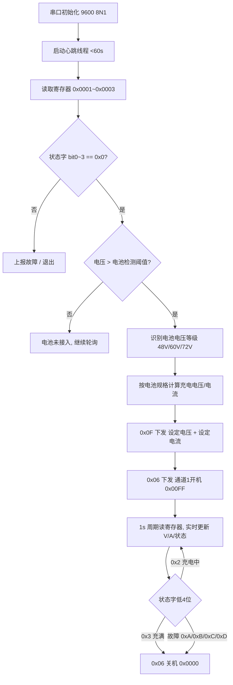

# 电池检测与启动充电实现文档

> 基于《换电柜仓位与充电器通信协议 V1.5》，实现流程：**接入电池 → 查询电池信息 → 设置充电电流/电压 → 启动充电 → 状态轮询**。

---

## 1. 总体流程



---

## 2. 串口与通讯基础

| 项 | 值 |
|----|----|
| 物理层 | RS485 半双工 |
| 波特率 | 9600 |
| 数据格式 | 8N1（8 数据位、无校验、1 停止位）|
| 协议 | 标准 Modbus RTU（大端字节序）|
| CRC | Modbus CRC16（见协议 §CRC16 算法源码）|
| 从机地址 | 0x00（默认，与仓控板一致）|
| 空闲超时 | **充电器 60s 无指令即断输出自动关机**，主机须 ≤ 30s 发一次任意指令作为心跳 |

---

## 3. 指令速查表

| 用途 | 方向 | 功能码 | 报文模板 |
|------|------|--------|----------|
| 读电压/电流/状态 | 主→从 | 0x03 | `00 03 00 01 00 03 CRC CRC` |
| 设置电压+电流 | 主→从 | 0x0F | `00 0F 00 01 00 02 04 VH VL IH IL CRC CRC` |
| 通道1 开机 | 主→从 | 0x06 | `00 06 00 00 00 FF C8 5B` |
| 通道1 关机 | 主→从 | 0x06 | `00 06 00 00 00 00 88 1B` |
| 通道2 开机 | 主→从 | 0x06 | `00 06 00 00 10 FF C5 9B` |
| 通道2 关机 | 主→从 | 0x06 | `00 06 00 00 10 00 85 DB` |

**编码规则：**
- 电压：寄存器值 = 实际电压 × 10（如 48.0V → 480 → `0x01E0`）
- 电流：**设定**寄存器值 = 实际电流 × 10（6.0A → 600 → `0x0258`）；**读取**寄存器值 = 实际电流 × 100（5.5A → 550 → `0x0226`，见协议 §3）

---

## 4. 电池信息查询（关键步骤）

协议没有独立的"电池检测"寄存器。检测原理：**充电器输出端直接并联电池，读取寄存器 0x01（电压）即为电池端电压**。

### 4.1 请求帧

```
TX: 00 03 00 01 00 03 54 08
```

### 4.2 应答帧解析（示例）

```
RX: 00 03 06 01 E0 00 00 00 00 44 39
       ├─ 06:  字节数
       ├─ 01 E0:  电压 480 → 48.0V
       ├─ 00 00:  电流 0.00A（未开机）
       └─ 00 00:  状态字 = 0x0000（空闲正常）
```

### 4.3 电池判定逻辑

| 测量电压 Vbat | 判定 | 动作 |
|---------------|------|------|
| < 10.0V | 电池未接入 / 严重亏电 | 不启动，继续轮询 |
| 10.0 ~ 55.0V | 48V 电池组 | 按 48V 策略充电 |
| 55.0 ~ 68.0V | 60V 电池组 | 按 60V 策略充电 |
| 68.0 ~ 85.0V | 72V 电池组 | 按 72V 策略充电 |
| ≥ 目标满电压 | 已充满 | 不启动 |

**同步检查状态字 bit0~3**：
- `0x0` 空闲 → 正常
- `0xA` 超压 / `0xB` 反接 / `0xC` NTC故障 / `0xD` 短路 → **禁止开机**，上报故障

---

## 5. 设置电压电流

按电池等级查出 `充电电压 Vset`、`充电电流 Iset`：

| 电池 | Vset | Iset（示例） |
|------|------|--------------|
| 48V  | 58.4V | 6.0A |
| 60V  | 73.0V | 6.0A |
| 72V  | 87.6V | 8.0A |

以 48V 为例：Vset=584(`0x0248`)，Iset=60(`0x003C`)（注意设定时电流放大 10 倍）。

### 下发帧

```
TX: 00 0F 00 01 00 02 04 02 48 00 3C CRC CRC
           │  │     │  │  └───┬───┘ └───┬───┘
           │  │     │  │      │         └─ 电流寄存器 60 → 6.0A
           │  │     │  │      └─ 电压寄存器 584 → 58.4V
           │  │     │  └─ 4 字节数据
           │  │     └─ 写 2 个寄存器
           │  └─ 起始寄存器 0x0001
           └─ 功能码 0x0F
```

### 应答帧

```
RX: 00 0F 00 01 00 02 CRC CRC   → 设置成功
```

---

## 6. 启动充电（开机）

```
TX: 00 06 00 00 00 FF C8 5B   → 通道1开机
RX: 00 06 00 00 00 FF C8 5B   → 回显相同
```

开机后 1~3s 内状态字 bit0~3 会由 `0x1`（开机中）→ `0x2`（充电中），此时再次读电流寄存器应 > 0。

---

## 7. 运行态轮询

- **周期**：1 s（心跳+数据合一）
- **每次**：发 `00 03 00 01 00 03 54 08`
- **解析**：实时电压、电流、状态字

### 终止条件

| 状态字 bit0~3 | 含义 | 上层动作 |
|---------------|------|----------|
| 0x2 | 充电中 | 继续轮询 |
| 0x3 | 充满 | 下发关机 `00 06 00 00 00 00 88 1B` |
| 0xA / 0xB / 0xC / 0xD | 故障 | 关机 + 告警 |
| bit4~bit14 任一置位 | 过温 / 继电器粘连 / 欠压 / 过压 / 通讯故障 | 关机 + 告警 |

---

## 8. 状态机（C 伪代码）

```c
typedef enum {
    ST_IDLE,          // 等待电池接入
    ST_DETECTED,      // 已检测到电池
    ST_CONFIG,        // 已下发电压电流
    ST_CHARGING,      // 充电中
    ST_FINISH,        // 充满
    ST_FAULT          // 故障
} ChargeState;

static ChargeState st = ST_IDLE;

void tick_1s(void)
{
    ChargerInfo info;
    if (!read_regs(&info)) return;     // 读 0x0001~0x0003

    // 故障优先
    uint8_t code = info.status & 0x000F;
    if (code == 0xA || code == 0xB || code == 0xC || code == 0xD
        || (info.status & 0xFFF0)) {
        cmd_power_off(1);
        st = ST_FAULT;
        return;
    }

    switch (st) {
    case ST_IDLE:
        if (info.voltage_dV >= 100) {          // >=10.0V 认为接入
            g_vbat = info.voltage_dV;
            st = ST_DETECTED;
        }
        break;

    case ST_DETECTED: {
        BatterySpec s = match_battery(g_vbat);  // 4.3 的判定
        cmd_set_vi(s.vset_dV, s.iset_dA);       // 0x0F
        st = ST_CONFIG;
        break;
    }

    case ST_CONFIG:
        cmd_power_on(1);                        // 0x06 0x00FF
        st = ST_CHARGING;
        break;

    case ST_CHARGING:
        if (code == 0x3) {                      // 充满
            cmd_power_off(1);
            st = ST_FINISH;
        }
        break;

    case ST_FINISH:
    case ST_FAULT:
        /* 等待电池拔出 → 复位到 ST_IDLE */
        if (info.voltage_dV < 100) st = ST_IDLE;
        break;
    }
}
```

---

## 9. 关键工具函数

### 9.1 CRC16（协议原文移植）

```c
uint16_t modbus_crc16(const uint8_t *buf, int len)
{
    uint16_t c = 0xFFFF;
    for (int k = 0; k < len; k++) {
        uint16_t b = buf[k];
        for (int i = 0; i < 8; i++) {
            c = ((b ^ c) & 1) ? (c >> 1) ^ 0xA001 : (c >> 1);
            b >>= 1;
        }
    }
    return (c << 8) | (c >> 8);   // 高低字节交换
}
```

### 9.2 读电压/电流/状态

```c
bool read_regs(ChargerInfo *out)
{
    uint8_t tx[] = { 0x00, 0x03, 0x00, 0x01, 0x00, 0x03, 0, 0 };
    uint16_t crc = modbus_crc16(tx, 6);
    tx[6] = crc >> 8; tx[7] = crc & 0xFF;

    uart_send(tx, 8);
    uint8_t rx[11];
    if (uart_recv(rx, 11, 500) != 11) return false;
    if (rx[0] != 0x00 || rx[1] != 0x03 || rx[2] != 0x06) return false;
    if (modbus_crc16(rx, 9) != ((rx[9] << 8) | rx[10])) return false;

    out->voltage_dV = (rx[3] << 8) | rx[4];   // 单位 0.1V
    out->current_cA = (rx[5] << 8) | rx[6];   // 单位 0.01A（读取）
    out->status     = (rx[7] << 8) | rx[8];
    return true;
}
```

### 9.3 设置电压电流

```c
bool cmd_set_vi(uint16_t v_dV, uint16_t i_dA)
{
    uint8_t f[] = {
        0x00, 0x0F, 0x00, 0x01, 0x00, 0x02, 0x04,
        v_dV >> 8, v_dV & 0xFF,
        i_dA >> 8, i_dA & 0xFF,
        0, 0
    };
    uint16_t crc = modbus_crc16(f, 11);
    f[11] = crc >> 8; f[12] = crc & 0xFF;
    uart_send(f, 13);

    uint8_t rx[8];
    return uart_recv(rx, 8, 500) == 8 && rx[1] == 0x0F;
}
```

### 9.4 开关机

```c
bool cmd_power_on (uint8_t ch) { return send_0x06(ch ? 0x10FF : 0x00FF); }
bool cmd_power_off(uint8_t ch) { return send_0x06(ch ? 0x1000 : 0x0000); }
```

---

## 10. 注意事项

1. **60s 心跳硬约束**：即使处于 `ST_IDLE` 也要每秒发一次 `0x03` 读命令，否则充电器自动关机。
2. **上电默认关机**：充电器上电后处于关机态，`ST_IDLE` 读到的电压就是电池端电压，可直接用于电池识别。
3. **设置先于开机**：务必先下发 `0x0F` 设置好电压电流，再 `0x06` 开机，否则可能以旧参数启动。
4. **电流单位不对称**：设置时 ×10（0.1A 分辨率），读取时 ×100（0.01A 分辨率），实现中勿混用。
5. **反接保护**：状态字低 4 位为 `0xB` 时严禁开机，需提示用户拔出重接。
6. **多模块场景**：若同一 485 总线挂多台充电器，需先用 `0x06 0x03E8` 为各模块分配唯一地址，再分别通讯。
