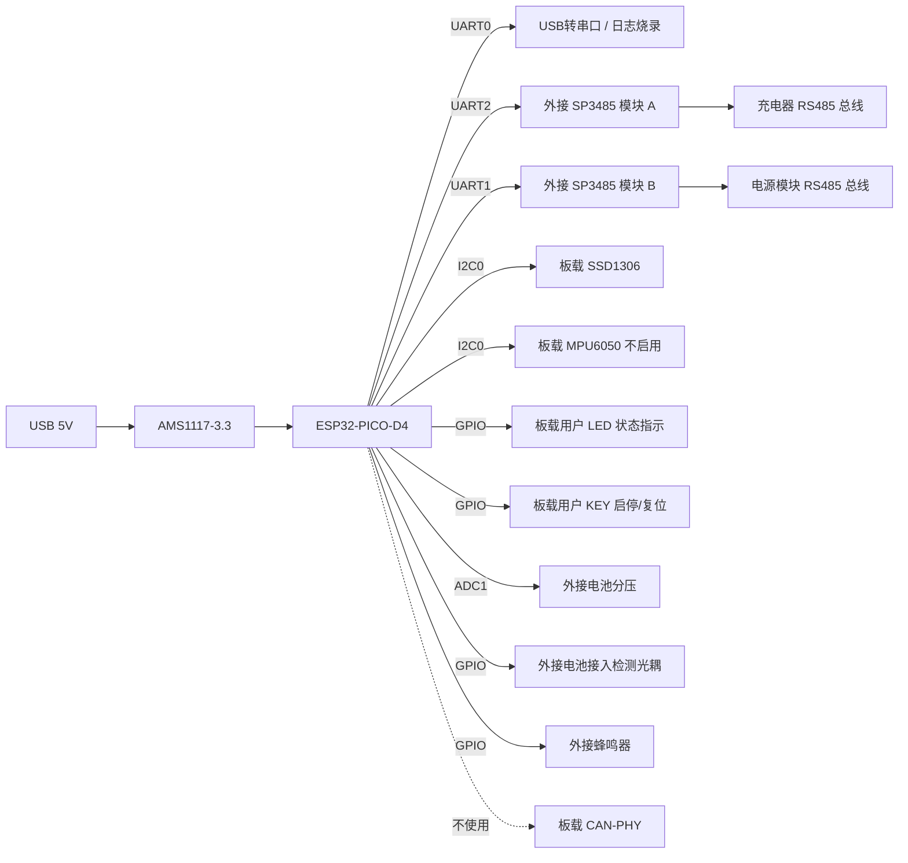

# ESP32-PicoD4 充电器主控硬件实现方案

> 硬件基线：[基于ESP32-PicoD4的开源迷你开发板](https://oshwhub.com/ChenJa/esp32-pico)（Copy by 稚晖君 [ESP32-PicoDK](https://github.com/peng-zhihui/ESP32-PicoDK)）。配合《协议.md》《实现文档.md》使用，给出基于该开发板的外设映射、外接电路、软件架构与移植要点。

---

## 1. 开发板能力梳理

| 项 | 说明 |
|----|------|
| 主控 SiP | **ESP32-PICO-D4**（双核 Xtensa LX6 @ 240 MHz，520 KB SRAM，内封 4 MB Flash） |
| 无线 | 内置 Wi-Fi 802.11 b/g/n + BT 4.2 BR/EDR + BLE |
| 板载外设 | MPU6050、SSD1306 OLED（128×64）、CAN-PHY、USB-Serial、用户 LED、用户 KEY |
| 引脚 | 所有 GPIO 引出，外设跳线可断开，**不影响 GPIO 复用** |
| 供电 | USB 5V → AMS1117-3.3 3.3V/800mA |
| 调试 | USB 转串口（CP2102/CH340，UART0） |

> 板上**未集成 RS485 收发器**，需外接 **2 路** SP3485/MAX3485 模块（UART1 接电源、UART2 接充电器）。

---

## 2. 系统框图



---

## 3. 引脚映射（基于 ESP32-PICO-D4）

> ESP32-PICO-D4 共 3 个 UART：UART0 留给 USB-Serial 日志；UART2 走 IOMUX 默认引脚接**充电器**；UART1 通过 GPIO Matrix 重映射到空闲引脚接**电源模块**。

| 功能 | ESP32 GPIO | 开发板位置 | 备注 |
|------|-----------|-----------|------|
| **充电器** RS485 TX | **GPIO17** (U2_TXD) | 板侧排针 | 接 SP3485-A 的 DI |
| **充电器** RS485 RX | **GPIO16** (U2_RXD) | 板侧排针 | 接 SP3485-A 的 RO |
| **充电器** RS485 DIR | **GPIO4** | 板侧排针 | UART2 RTS，半双工自动控制 DE/RE |
| **电源** RS485 TX | **GPIO27** (U1_TXD 重映射) | 板侧排针 | 接 SP3485-B 的 DI |
| **电源** RS485 RX | **GPIO26** (U1_RXD 重映射) | 板侧排针 | 接 SP3485-B 的 RO |
| **电源** RS485 DIR | **GPIO14** | 板侧排针 | UART1 RTS，半双工自动控制 DE/RE |
| OLED I2C SDA | GPIO21 | 板载跳线已接 | SSD1306 0x3C |
| OLED I2C SCL | GPIO22 | 板载跳线已接 | 同上 |
| 用户 LED | GPIO2 | 板载 | 状态指示，PWM 呼吸 |
| 用户 KEY | GPIO0 | 板载 | 启停 / 长按复位（同 BOOT 键，固件中区分） |
| USB-Serial TX | GPIO1 (U0_TXD) | 板载 | 仅日志/烧录 |
| USB-Serial RX | GPIO3 (U0_RXD) | 板载 | 仅日志/烧录 |
| 电池分压 ADC | **GPIO34** (ADC1_CH6) | 排针外接 | 100k/10k 分压，量程 0~10V |
| 电池接入光耦 | **GPIO35** | 排针外接 | 输入专用 GPIO，上拉 |
| 蜂鸣器 PWM | **GPIO25** | 排针外接 | LEDC，故障提示音 |
| MPU6050 / CAN | — | 板载 | **断开跳线**，对应 GPIO 留作通用 |

> 板上 MPU6050 与 OLED 共享 I2C0（GPIO21/22）。本项目仅使用 OLED，可不焊或不上电 MPU6050。CAN-PHY 跳线断开即可。

---

## 4. 外接双路 RS485 子板电路

两路 RS485 电路完全相同，仅引脚与下游设备不同。

### 4.1 子板 A —— 充电器总线（UART2）

```
                +3.3V
                  │
         ┌────────┴────────┐
   GPIO17├──DI       VCC───┤
   GPIO4 ├──DE/RE          │
   GPIO16├──RO       GND───┤
         │   SP3485-A      │
         └──A────────B─────┘
            │        │
            ├─120Ω─┤        终端电阻
            ├─680Ω→3V3      偏置上拉
            └─680Ω→GND      偏置下拉
                  │
            TVS SM712 防浪涌
                  │
            → 充电器 RS485 接口
```

### 4.2 子板 B —— 电源模块总线（UART1）

```
                +3.3V
                  │
         ┌────────┴────────┐
   GPIO27├──DI       VCC───┤
   GPIO14├──DE/RE          │
   GPIO26├──RO       GND───┤
         │   SP3485-B      │
         └──A────────B─────┘
            │        │
            ├─120Ω─┤        终端电阻
            ├─680Ω→3V3      偏置上拉
            └─680Ω→GND      偏置下拉
                  │
            TVS SM712 防浪涌
                  │
            → 电源模块 RS485 接口
```

- 模块推荐：基于 **SP3485EEN / MAX3485** 的 3.3V 半双工收发模块
- DE 与 RE 短接，由对应 GPIO（GPIO4 / GPIO14）统一控制，发送时拉高
- A/B 串 10Ω 限流后再到 TVS
- 两路总线**相互独立、各自做终端与偏置**，避免地环路
- 与下游设备之间均使用屏蔽双绞线，屏蔽层单端接主控 GND
- 若电源模块协议为 RS232/TTL，可将子板 B 替换为 MAX3232 / 直连即可，软件层无需改动

---

## 5. 电池接入与电压检测

### 5.1 主路径
仍以**协议读寄存器返回的电压值**为电池电压主依据（精度由充电器保证）。

### 5.2 辅助路径（开发板侧）
- 电池+ → 100kΩ → ADC 引脚（GPIO34），ADC 引脚再通过 10kΩ 下拉到 GND
  - 分压比 1:11，电池 84V 时 ADC 输入 ≈ 0.7V，需根据电池上限改用 470kΩ/10kΩ（≈1:48）
- 电池+ → 1kΩ → 光耦 PC817 输入 → 输出 OC 接 GPIO35（上拉到 3.3V）
  - 电池接入：GPIO35 = 0
  - 电池拔出：GPIO35 = 1
- 软件以"光耦边沿"作为状态机 `ST_IDLE → ST_DETECTED` 触发，避免依赖 ADC 噪声

---

## 6. 软件架构（ESP-IDF v5.x + FreeRTOS）

### 6.1 任务划分

| 任务 | 优先级 | 周期 | 职责 |
|------|--------|------|------|
| `task_modbus_chg` | 5 | 1000 ms | UART2 与充电器通信，更新 `g_charger_info` |
| `task_modbus_psu` | 5 | 1000 ms | UART1 与电源模块通信，更新 `g_psu_info` |
| `task_fsm` | 4 | 200 ms | 综合两路数据推进状态机，下发 `set_vi`/开机/关机 |
| `task_ui` | 3 | 100 ms | OLED 刷新（双路电压/电流/状态/进度） |
| `task_io` | 3 | 20 ms | KEY 扫描、LED/蜂鸣器、光耦消抖 |
| `task_log` | 1 | 事件 | 串口日志（USB-Serial） |

> 两路 Modbus 任务**完全独立**，分别持有自己的 UART 句柄、互斥锁与超时统计；任一路通信故障不影响另一路。

### 6.2 双路 RS485 驱动（UART1 + UART2 半双工）

```c
/* —— 充电器 UART2 —— */
#define CHG_TXD  GPIO_NUM_17
#define CHG_RXD  GPIO_NUM_16
#define CHG_DE   GPIO_NUM_4

/* —— 电源 UART1 —— */
#define PSU_TXD  GPIO_NUM_27
#define PSU_RXD  GPIO_NUM_26
#define PSU_DE   GPIO_NUM_14

static void rs485_init(uart_port_t port, int tx, int rx, int de)
{
    uart_config_t cfg = {
        .baud_rate  = 9600,
        .data_bits  = UART_DATA_8_BITS,
        .parity     = UART_PARITY_DISABLE,
        .stop_bits  = UART_STOP_BITS_1,
        .flow_ctrl  = UART_HW_FLOWCTRL_DISABLE,
        .source_clk = UART_SCLK_DEFAULT,
    };
    uart_driver_install(port, 256, 256, 0, NULL, 0);
    uart_param_config(port, &cfg);
    uart_set_pin(port, tx, rx, de /* RTS = DE/RE */, UART_PIN_NO_CHANGE);
    uart_set_mode(port, UART_MODE_RS485_HALF_DUPLEX);   // 硬件自动翻转 DE
}

void rs485_init_all(void)
{
    rs485_init(UART_NUM_2, CHG_TXD, CHG_RXD, CHG_DE);   // 充电器
    rs485_init(UART_NUM_1, PSU_TXD, PSU_RXD, PSU_DE);   // 电源
}
```

> - ESP32 在 `RS485_HALF_DUPLEX` 模式下硬件自动拉高 RTS（DE/RE），无需软件干预
> - **UART1 默认引脚被内部 Flash 占用**，必须如上通过 `uart_set_pin` 重映射到 GPIO27/26/14
> - 协议层 `read_regs() / cmd_set_vi() / cmd_power_xx()` 增加 `uart_port_t port` 参数，两个任务调用时分别传入 `UART_NUM_2` / `UART_NUM_1`

### 6.3 OLED UI（SSD1306 + I2C）

界面布局（128×64）：

```
┌──────────────────────────────┐
│ CHG 48.0V 5.50A  ST:充电中   │  第 1 行：充电器侧
│ PSU 53.2V 6.00A  ST:OK       │  第 2 行：电源侧
│ T : 00:23:14   SOC:62%       │  第 3 行：累计时长 / SOC
│ ━━━━━━━━━━━━━━━━━━━━ 62%    │  第 4 行：进度条
└──────────────────────────────┘
```

推荐组件：`u8g2` 或 `lvgl`（小屏可优先 u8g2，节省 RAM）。

### 6.4 状态机
直接复用《实现文档.md §8》中 `ChargeState` 枚举和 `tick_1s()` 实现，仅需将 `read_regs()` / `cmd_set_vi()` / `cmd_power_on()` 的底层 `uart_send/recv` 替换为 ESP-IDF 的 `uart_write_bytes()` / `uart_read_bytes()`。

---

## 7. 与开发板原生外设的取舍

| 板载外设 | 是否使用 | 处理方式 |
|----------|----------|----------|
| SSD1306 OLED | **使用** | 保留板载跳线，I2C 地址 0x3C |
| MPU6050 | 不使用 | 拆掉跳线或不焊；释放 I2C 空间（仍与 OLED 共享 I2C0） |
| CAN-PHY | 不使用 | 断开跳线，对应 GPIO 留空 |
| USB 转串口 | 使用 | UART0 仅用于日志、烧录、开发调试 |
| 用户 LED (GPIO2) | 使用 | 慢闪=空闲、快闪=充电中、常亮=充满、急闪=故障 |
| 用户 KEY (GPIO0) | 使用 | 短按强制启动/停止；长按 3s 软复位 |

---

## 8. 移植与编译要点

1. **环境**：ESP-IDF v5.1+，目标芯片 `esp32`（不是 esp32-s3/c3）
   ```bash
   idf.py set-target esp32
   idf.py menuconfig   # 串口、Flash 4MB DIO、PSRAM 关闭
   ```
2. **分区表**：可用默认 `partitions_two_ota.csv`，启用 OTA
3. **依赖组件**：`esp_driver_uart`、`esp_driver_gpio`、`esp_adc`、`u8g2`（外部组件，通过 `idf_component.yml` 添加）
4. **看门狗**：开启 Task WDT，5s；`task_modbus`、`task_fsm` 在循环末尾 `esp_task_wdt_reset()`
5. **OTA**：复用 USB-Serial 烧录（开发期）或 Wi-Fi HTTPS OTA（量产期）

---

## 9. BOM 增量物料（除开发板外）

| 类别 | 型号 | 数量 | 备注 |
|------|------|------|------|
| RS485 模块 | SP3485/MAX3485 模块 | **2** | 3.3V 兼容、半双工（充电器 + 电源各一）|
| 终端电阻 | 120Ω 1% | **4** | 两路总线各两端 |
| 偏置电阻 | 680Ω 1% | **4** | 两路各上下拉 |
| TVS | SM712 | **2** | 两路 A/B 防浪涌 |
| 光耦 | PC817 | 1 | 电池接入检测 |
| 电阻分压 | 470kΩ + 10kΩ 1% | 各 1 | ADC 采样 |
| 蜂鸣器 | 5V 有源 | 1 | 故障提示 |
| 接线端子 | KF128-2P / KF128-3P | 若干 | 电池、两路 RS485 接口 |

---

## 10. 验证清单

- [ ] OLED 上电显示开机界面（型号 + 固件版本）
- [ ] **充电器** 单帧 `00 03 00 01 00 03 54 08` 在 UART2 收发正常，CRC 校验通过
- [ ] **电源** 单帧 `00 03 00 01 00 03 54 08` 在 UART1 收发正常，CRC 校验通过
- [ ] 任一路 RS485 断开时，另一路通信不受影响（隔离性验证）
- [ ] 两路 `task_modbus_*` 1 s 周期连续 24 h，无丢帧、无 WDT 触发
- [ ] 拔出/插入电池，光耦 + ADC 双路均能在 200 ms 内识别状态翻转
- [ ] 故障注入（A/B 短接、电池反接），状态字解析正确进入 `ST_FAULT`，蜂鸣器 + LED 急闪
- [ ] 60 s 内无心跳，充电器自动关机；恢复心跳后 3 s 内重新启动
- [ ] 短按 KEY 可在 IDLE/CHARGING 之间手动切换；长按 3 s 触发 `esp_restart()`
- [ ] USB 串口波特率 115200 输出 INFO 级日志，关键事件含时间戳
